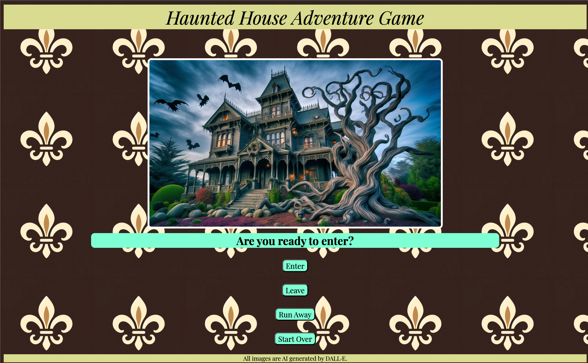

# Haunted House Adventure Game
This is a choose your own adventure game by Jonathan Cabrera.

## Planning material
[Pseudocode](https://docs.google.com/document/d/1SV8tzShGqxrGUyjIsjFcwTeC6qXYId20YHaXlfjx8yI/edit?usp=sharing)

## How to play
1. Choose any of the top three buttons to make your decision and continue the story.
2. Try to make it all the way through three different paths for three separate "good" endings.
3. At any time choose "Start Over" to reset the game.

## Technolgies Used

### Credits
All images are AI generated by DALL·E.

#### Stretch Goals
1. Making each image a unique link.
2. Play audio according to player choices.
    1. Ability to mute audio.
3. Create a hamburger menu that includes credits.